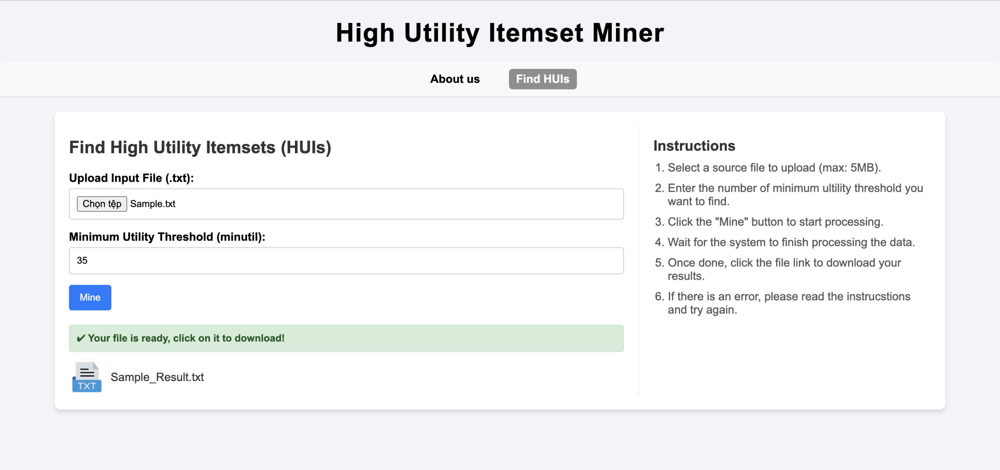

# High Utility Itemset Miner

## 📌 Giới thiệu

Đây là dự án môn học _Công nghệ Thông tin_, nơi nhóm chúng em nghiên cứu và triển khai các thuật toán khai thác tập mục chiếm dụng cao (High Utility Itemset Mining - HUIM) trong cơ sở dữ liệu tăng trưởng — một chủ đề quan trọng trong lĩnh vực _Data Mining_.

## 🔍 Nội dung chính

### 🧠 Thuật toán MEFIM

- Là một công cụ mạnh mẽ trong việc khai phá các tập mục chiếm dụng cao.
- Giới hạn không gian tìm kiếm thông qua việc ước lượng giá trị **utility**.
- Hạn chế: hiệu suất giảm trong các trường hợp dữ liệu lớn và mật độ cao do nhiều phép tính dư thừa.

### 🚀 Thuật toán iMEFIM (Cải tiến)

- Được nhóm đề xuất để khắc phục các điểm yếu của MEFIM.
- Sử dụng cấu trúc **P-set** và **Pex-set** kết hợp với kỹ thuật **phép chiếu (projection)**.
- Ưu điểm:
  - Loại bỏ các tập mục không tiềm năng.
  - Giảm số lần duyệt dữ liệu.
  - Rút gọn không gian tìm kiếm.
  - Tối ưu hoá tài nguyên và thời gian xử lý.
  - Tăng độ chính xác trong việc xác định các tập mục chiếm dụng cao.

## 📊 Kết quả thực nghiệm

- Thử nghiệm trên **6 tập dữ liệu mẫu** với nhiều ngưỡng utility khác nhau.
- **iMEFIM** vượt trội hơn **MEFIM** về:
  - **Thời gian xử lý**
  - **Dung lượng bộ nhớ sử dụng**

## 🌐 Ứng dụng web

Nhóm đã phát triển một ứng dụng web đơn giản có tên **High Utility Itemset Miner**:

- Giao diện xây dựng bằng **HTML & CSS**
- Backend sử dụng **Python**
- Tích hợp thuật toán **iMEFIM** để khai thác dữ liệu trực quan

##Cách chạy Source Code:
-Macbook:
source venv/bin/activate
python3 app.py
-Window:
venv\Scripts\activate
python app.py
